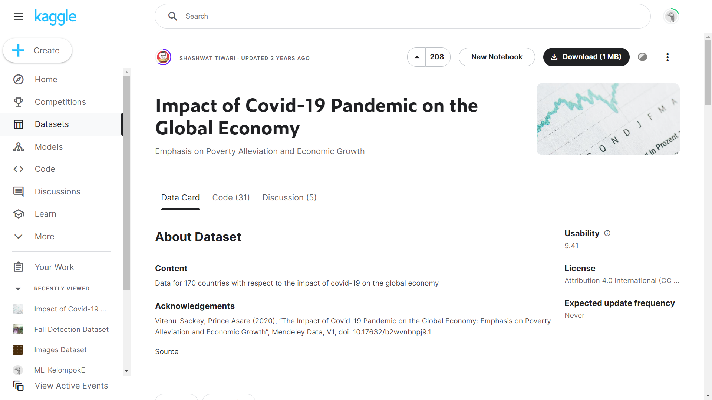
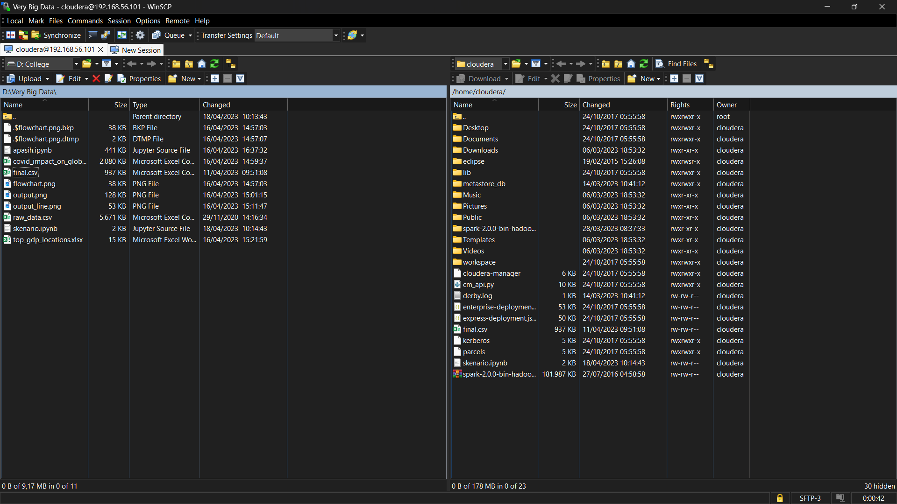
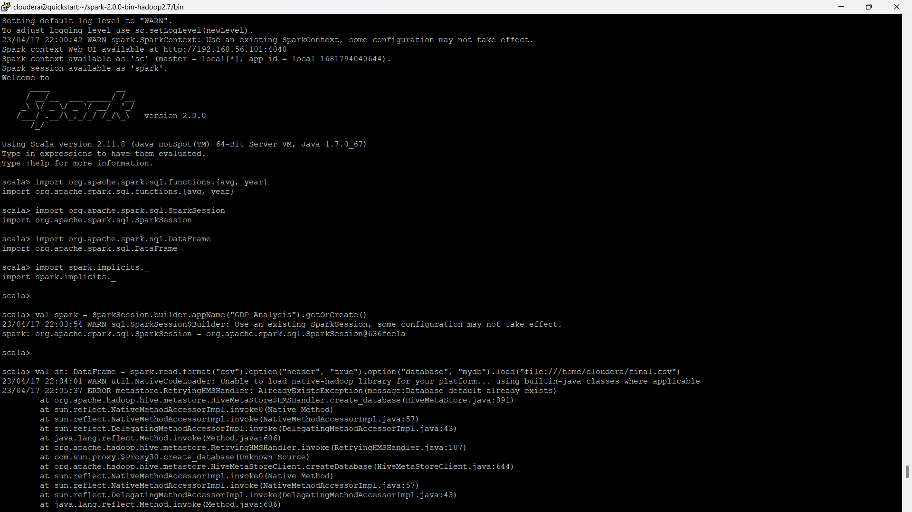
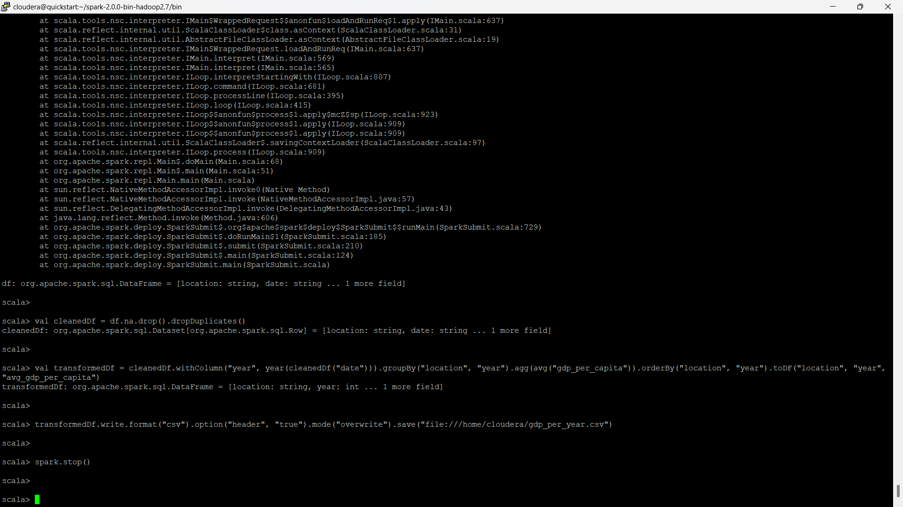
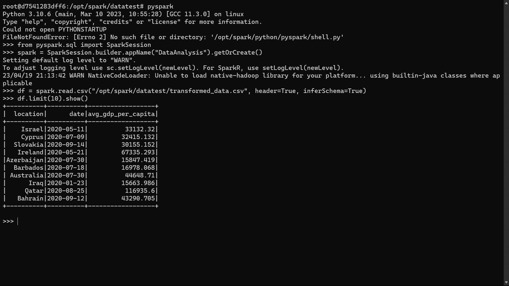

# Description

Repository ini berisi kode yang digunakan untuk menganalisis dataset "Impact of Covid-19 Pandemic on the Global Economy". Tujuan dari proyek ini adalah untuk melakukan preprocessing dan ETL pada data, melakukan analisis data menggunakan SparkSQL, DataFrames, atau Datasets, serta membuat visualisasi untuk memperlihatkan hasil analisis. Dataset ini berisi data tentang dampak pandemi Covid-19 pada ekonomi global. Data ini terdiri dari beberapa kolom seperti tanggal, lokasi, gdp_per_capita, kasus covid-19, kematian covid-19, dll. Proyek ini terdiri dari beberapa tahap. Tahap pertama adalah melakukan preprocessing dan ETL pada data. Pada tahap ini, data akan dibersihkan, duplikat akan dihapus, dan kolom baru seperti tahun akan ditambahkan. Selanjutnya, data akan diolah menggunakan SparkSQL, DataFrames, atau Datasets untuk menjawab beberapa pertanyaan terkait dampak pandemi pada ekonomi global. Tahap selanjutnya adalah membuat visualisasi. Pada tahap ini, data yang sudah diolah akan divisualisasikan menggunakan plotly API. Beberapa jenis visualisasi yang akan dibuat antara lain grafik batang dan grafik garis. Proyek ini diharapkan dapat memberikan pemahaman lebih dalam tentang dampak pandemi Covid-19 pada ekonomi global dan juga memberikan pengalaman dalam menggunakan SparkSQL, DataFrames, atau Datasets untuk menganalisis data besar.

# Dataset

Dataset bisa di download<a href="https://www.kaggle.com/datasets/shashwatwork/impact-of-covid19-pandemic-on-the-global-economy"> disini</a>.

Dataset "Impact of Covid-19 Pandemic on the Global Economy" adalah kumpulan data yang berisi informasi tentang dampak pandemi Covid-19 terhadap perekonomian global. Dataset ini memiliki 9 kolom yang mencakup informasi seperti kode ISO negara, lokasi, tanggal, jumlah kasus dan kematian Covid-19, indeks ketatnya kebijakan pencegahan Covid-19, jumlah penduduk, GDP per kapita, dan Indeks Pembangunan Manusia. Dataset ini dapat digunakan untuk menganalisis dampak pandemi Covid-19 terhadap perekonomian global dan membandingkan tingkat GDP per kapita antara negara yang terpengaruh pandemi dan tidak terpengaruh pandemi serta melihat korelasi antara kebijakan pencegahan Covid-19 dengan jumlah kasus Covid-19 dan kematian di suatu wilayah atau negara tertentu.

# Flowchart

Flowchart preprocessing data pada dataset "Impact of Covid-19 Pandemic on the Global Economy" dimulai dengan memuat data dari file yang tersedia. Proses pertama yang dilakukan adalah menghilangkan kolom yang tidak memiliki header, yang kemudian dilanjutkan dengan menghilangkan baris yang memiliki nilai null atau kosong.Setelah itu, data akan disortir berdasarkan waktu dan lokasi, dan kemudian dilakukan reset index untuk mengembalikan index yang diurutkan. Setelah proses ini selesai, pengguna akan dihadapkan pada sebuah decision point, yaitu apakah akan dilakukan proses ETL atau tidak. Jika pengguna memilih untuk melakukan proses ETL, maka langkah selanjutnya adalah mengambil kolom yang diperlukan untuk analisis dan menghitung rata-rata setiap tahun dari setiap negara selama pandemi Covid-19. Setelah itu, dilakukan visualisasi data untuk memudahkan pemahaman. Namun, jika pengguna memilih untuk tidak melakukan proses ETL, maka proses preprocessing data selesai dan data siap digunakan untuk analisis lebih lanjut.

# Preprocessing dan ETL

  <pre>
    <code>
import pandas as pd
import numpy as np
import matplotlib.pyplot as plt
import seaborn as sns

df = pd.read_csv('raw_data.csv')

df = df[['iso_code', 'location', 'date', 'total_cases', 'total_deaths', 'stringency_index', 'population', 'gdp_per_capita', 'human_development_index']]

df.dropna(inplace=True)

df['date'] = pd.to_datetime(df['date'])

df.sort_values(['location', 'date'], inplace=True)

df.reset_index(drop=True, inplace=True)

df.to_csv('covid_impact_on_global_economy_preprocessed.csv', index=False)
    </code>
  </pre>
  

    preprocessing data untuk dataset "Impact of Covid-19 Pandemic on the Global Economy" menggunakan library Pandas di Python. Preprocessing dilakukan untuk membersihkan data dari kolom-kolom yang tidak diperlukan dan baris-baris yang kosong/null. Kemudian dilakukan pengurutan data berdasarkan lokasi dan waktu, serta pengubahan format kolom tanggal ke dalam format datetime. Setelah itu, dilakukan penghapusan index lama dan penggantian dengan index yang baru. Terakhir, data yang telah di-preprocessing disimpan ke dalam file csv baru dengan nama "covid_impact_on_global_economy_preprocessed.csv".

# Visualisasi

  <pre>
    <code>
df['year'] = df['date'].dt.year

df_yearly_gdp = df.groupby(['location', 'year']).agg({'gdp_per_capita': 'mean'}).reset_index()

df_pivot = df_yearly_gdp.pivot(index='location', columns='year', values='gdp_per_capita')

plt.figure(figsize=(20, 50))
plt.title('Yearly GDP per Capita by Location')
sns.barplot(data=df_yearly_gdp, y='location', x='gdp_per_capita', hue='year', orient='h')
plt.xlabel('GDP per Capita')
plt.ylabel('Location')
plt.legend(loc='center right', bbox_to_anchor=(1.2, 0.5))
plt.tight_layout()
plt.show()
    </code>
  </pre>
  

visualisasi grafik batang yang menunjukkan rata-rata PDB per kapita setiap tahun di setiap lokasi. Langkah-langkah yang dilakukan meliputi menambahkan kolom tahun ke dalam dataframe, menghitung rata-rata PDB per kapita setiap tahun di setiap lokasi, mengubah struktur dataframe menjadi pivot table, dan membuat visualisasi grafik batang menggunakan library seaborn. Hasil akhirnya adalah grafik batang yang menunjukkan rata-rata PDB per kapita setiap tahun di setiap lokasi.  

  <pre>
    <code>
import geopandas as gpd
import matplotlib.pyplot as plt

world = gpd.read_file(gpd.datasets.get_path('naturalearth_lowres'))

gdp_2020 = df_yearly_gdp[df_yearly_gdp['year'] == 2020]
world_gdp = world.merge(gdp_2020, how='left', left_on='name', right_on='location')

fig, ax = plt.subplots(figsize=(20,10))
world_gdp.plot(column='gdp_per_capita',edgecolor=u'gray', cmap='Blues', ax=ax, legend=True, legend_kwds={'label': 'GDP per Capita ($)', 'orientation': 'horizontal'})
ax.set_title('World GDP per Capita in 2020')
ax.set_axis_off()

leg = ax.get_legend()

for text in leg.get_texts():
    text.set_color('white')

leg.get_title().set_color('white')

plt.show()
    </code>
  </pre>
  

membuat peta dunia dengan GDP per kapita sebagai variabel. Pertama, diambil data shapefile dunia dari library Geopandas, kemudian di-merge dengan data GDP tahunan yang sudah dihitung sebelumnya. Data GDP diambil untuk tahun 2020 saja. Selanjutnya, peta dunia dibuat dengan menampilkan data GDP per kapita menggunakan plot dengan skala warna yang berbeda-beda. Pada akhirnya, disesuaikan tampilan plot seperti judul, legenda, serta tampilan legend dan label untuk memastikan plot lebih mudah dipahami dan estetis.

# Proses Skenario

  <pre>
    <code>
import org.apache.spark.sql.functions.{avg, year}
import org.apache.spark.sql.SparkSession
import org.apache.spark.sql.DataFrame
import spark.implicits._

val spark = SparkSession.builder.appName("GDP Analysis").getOrCreate()

val df: DataFrame = spark.read.format("csv").option("header", "true").option("database", "mydb").load("file:///home/cloudera/final.csv")

val cleanedDf = df.na.drop().dropDuplicates()

val transformedDf = cleanedDf.withColumn("year", year(cleanedDf("date"))).groupBy("location", "year").agg(avg("gdp_per_capita")).orderBy("location", "year").toDF("location", "year", "avg_gdp_per_capita")

transformedDf.write.format("csv").option("header", "true").mode("overwrite").save("file:///home/cloudera/gdp_per_year.csv")

spark.stop()
    </code>
  </pre>
  

Apache Spark untuk melakukan analisis data pada file CSV berisi data GDP. Proses yang dilakukan adalah membaca file CSV menggunakan SparkSession, membersihkan dan memproses data, menambahkan kolom baru untuk menghitung rata-rata GDP per kapita berdasarkan tahun dan lokasi, serta menyimpan hasil analisis ke dalam file CSV. Tahap-tahap tersebut dilakukan menggunakan operasi DataFrame Spark SQL dan fungsi-fungsi Spark SQL seperti avg() dan year(). kami menggunakan DataFrame yang menggunakan fungsi-fungsi seperti .na.drop(), .withColumn(), .groupBy(), .agg(), .orderBy(), dan .toDF(). Selain itu, variabel df juga dideklarasikan sebagai objek DataFrame dengan tipe DataFrame. Sedangkan jika menggunakan Dataset, maka kita akan menggunakan fungsi-fungsi seperti .filter(), .map(), dan .reduce().

Proses pertama melakukan upload data CSV menggunakan winscp selanjutnya melakukan ekseskusi kode scala diatas dan hasilnya tertera pada gambar terakhir dengan nama file gdp_per_year.csv 

# Kendala
Terdapat kendala dalam menampilkan visualisasi di Spark dikarenakan library atau package yang tidak bisa di install
