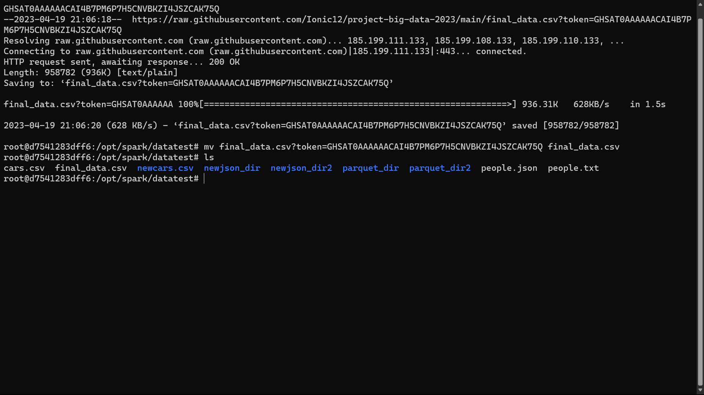

# Description

Repository ini berisi kode yang digunakan untuk menganalisis dataset "Impact of Covid-19 Pandemic on the Global Economy". Tujuan dari proyek ini adalah untuk melakukan preprocessing dan ETL pada data, melakukan analisis data menggunakan SparkSQL, DataFrames, atau Datasets, serta membuat visualisasi untuk memperlihatkan hasil analisis. Dataset ini berisi data tentang dampak pandemi Covid-19 pada ekonomi global. Data ini terdiri dari beberapa kolom seperti tanggal, lokasi, gdp_per_capita, kasus covid-19, kematian covid-19, dll. Proyek ini terdiri dari beberapa tahap. Tahap pertama adalah melakukan preprocessing dan ETL pada data. Pada tahap ini, data akan dibersihkan, duplikat akan dihapus, dan kolom baru seperti tahun akan ditambahkan. Selanjutnya, data akan diolah menggunakan SparkSQL, DataFrames, atau Datasets untuk menjawab beberapa pertanyaan terkait dampak pandemi pada ekonomi global. Tahap selanjutnya adalah membuat visualisasi. Pada tahap ini, data yang sudah diolah akan divisualisasikan menggunakan plotly API. Beberapa jenis visualisasi yang akan dibuat antara lain grafik batang dan grafik garis. Proyek ini diharapkan dapat memberikan pemahaman lebih dalam tentang dampak pandemi Covid-19 pada ekonomi global dan juga memberikan pengalaman dalam menggunakan SparkSQL, DataFrames, atau Datasets untuk menganalisis data besar.

# Dataset

Dataset bisa di download<a href="https://www.kaggle.com/datasets/shashwatwork/impact-of-covid19-pandemic-on-the-global-economy"> disini</a>.

Dataset "Impact of Covid-19 Pandemic on the Global Economy" adalah kumpulan data yang berisi informasi tentang dampak pandemi Covid-19 terhadap perekonomian global. Dataset ini memiliki 9 kolom yang mencakup informasi seperti kode ISO negara, lokasi, tanggal, jumlah kasus dan kematian Covid-19, indeks ketatnya kebijakan pencegahan Covid-19, jumlah penduduk, GDP per kapita, dan Indeks Pembangunan Manusia. Dataset ini dapat digunakan untuk menganalisis dampak pandemi Covid-19 terhadap perekonomian global dan membandingkan tingkat GDP per kapita antara negara yang terpengaruh pandemi dan tidak terpengaruh pandemi serta melihat korelasi antara kebijakan pencegahan Covid-19 dengan jumlah kasus Covid-19 dan kematian di suatu wilayah atau negara tertentu.

# Flowchart

Flowchart preprocessing data pada dataset "Impact of Covid-19 Pandemic on the Global Economy" dimulai dengan memuat data dari file yang tersedia. Proses pertama yang dilakukan adalah menghilangkan kolom yang tidak memiliki header, yang kemudian dilanjutkan dengan menghilangkan baris yang memiliki nilai null atau kosong.Setelah itu, data akan disortir berdasarkan waktu dan lokasi, dan kemudian dilakukan reset index untuk mengembalikan index yang diurutkan. Setelah proses ini selesai, pengguna akan dihadapkan pada sebuah decision point, yaitu apakah akan dilakukan proses ETL atau tidak. Jika pengguna memilih untuk melakukan proses ETL, maka langkah selanjutnya adalah mengambil kolom yang diperlukan untuk analisis dan menghitung rata-rata setiap tahun dari setiap negara selama pandemi Covid-19. Setelah itu, dilakukan visualisasi data untuk memudahkan pemahaman. Namun, jika pengguna memilih untuk tidak melakukan proses ETL, maka proses preprocessing data selesai dan data siap digunakan untuk analisis lebih lanjut.

# Preprocessing dan ETL

  <pre>
    <code>
from pyspark.sql import SparkSession
from pyspark.sql.functions import to_date
spark = SparkSession.builder.appName("DataAnalysis").getOrCreate()
df = spark.read.format("csv").option("header", "true").load("raw_data.csv")
df = df.select("iso_code", "location", "date", "total_cases", "total_deaths", "stringency_index", "population", "gdp_per_capita", "human_development_index")
df = df.na.drop()
df = df.withColumn("date", to_date(df["date"]))
df = df.orderBy(["location", "date"])
df.write.mode("overwrite").option("header", "true").csv("covid_impact_on_global_economy_preprocessed.csv")
    </code>
  </pre>
  

    membuat sebuah SparkSession dengan nama "DataAnalysis". Kemudian,  memuat file "raw_data.csv" ke dalam sebuah DataFrame menggunakan format sumber data CSV dan opsi "header" yang diatur ke "true" untuk menunjukkan bahwa baris pertama file berisi nama kolom. Kode memilih kolom yang relevan untuk dianalisis, yaitu "iso_code", "location", "date", "total_cases", "total_deaths", "stringency_index", "population", "gdp_per_capita", dan "human_development_index". Langkah berikutnya menghapus baris apa pun dengan nilai yang hilang menggunakan metode "na.drop()". Kolom tanggal kemudian dikonversi dari tipe string menjadi tipe tanggal menggunakan fungsi "to_date()" dari modul "pyspark.sql.functions". DataFrame kemudian diurutkan berdasarkan lokasi dan tanggal menggunakan metode "orderBy()". Akhirnya, data yang telah diproses disimpan ke dalam file CSV menggunakan metode "write()" dengan mode "overwrite" dan opsi "header" yang diatur ke "true" untuk menyertakan nama kolom dalam file output.

# Proses Skenario dan Visualisasi
## Skenario 1

  <pre>
    <code>
from pyspark.sql import SparkSession
from pyspark.sql.functions import avg
import matplotlib.pyplot as plt
import seaborn as sns
spark = SparkSession.builder.appName("DataAnalysis").getOrCreate()
df = spark.read.csv("/opt/spark/datatest/final_data.csv", header=True, inferSchema=True)
df = df.dropDuplicates()
df = df.na.drop()
df_transformed = df.groupBy(["location", "date"]).agg(avg("gdp_per_capita").alias("avg_gdp_per_capita"))
fig, ax = plt.subplots()
sns.lineplot(x="date", y="avg_gdp_per_capita", hue="location", data=df_transformed.toPandas(), ax=ax)
ax.set_title("Average GDP per Capita by Location")
plt.show()
df_transformed.write.csv("transformed_data.csv", header=True)
    </code>
  </pre>
  

Pada skenario ini yang dilakukan adalah melakukan analisa mengenai average GDP pada setiap negara pada saat pandemi Covid-19 dengan harapan data analisa dapat digunakan untuk membantu dalam memahami seberapa besar dampak pandemi Covid-19 pada perekonomian dan kesejahteraan masyarakat di berbagai negara.Pertama-tama, dataset di-load dari file CSV menggunakan PySpark SparkSession dan dibersihkan dari data yang tidak valid seperti data kosong dan duplikat. Setelah data bersih, data di-transformasikan dengan menggunakan fungsi PySpark groupBy dan agg untuk menghitung rata-rata gdp_per_capita dari setiap lokasi dan tanggal. Selanjutnya, hasil analisis divisualisasikan dengan menggunakan fungsi matplotlib dan seaborn untuk menghasilkan grafik garis yang menunjukkan rata-rata GDP per Kapita untuk setiap lokasi dan tanggal. Terakhir, hasil analisis diekspor ke dalam format CSV menggunakan fungsi PySpark write. Kode tersebut menunjukkan contoh dari proses analisis data yang lengkap dengan PySpark, dimulai dari loading data, pembersihan data, transformasi data, visualisasi data, dan ekspor hasil analisis.

## upload

## proses

## hasil

## Skenario 2

  <pre>
    <code>
from pyspark.sql import SparkSession
from pyspark.sql.functions import avg
import matplotlib.pyplot as plt
import seaborn as sns
spark = SparkSession.builder.appName("DataAnalysis").getOrCreate()
df = spark.read.csv("/opt/spark/datatest/raw_data.csv", header=True, inferSchema=True)
df = df.dropDuplicates()
df = df.na.drop()
df_transformed = df.select("location", "date", "total_cases", "total_deaths", "stringency_index") \
                   .groupBy(["location", "date"]).agg({"total_cases": "sum", "total_deaths": "sum", "stringency_index": "avg"}) \
                   .withColumnRenamed("sum(total_cases)", "total_cases") \
                   .withColumnRenamed("sum(total_deaths)", "total_deaths") \
                   .withColumnRenamed("avg(stringency_index)", "avg_stringency_index")
df_transformed.select("location", "date", "total_cases", "total_deaths", "avg_stringency_index").write.csv("transformed_data.csv", header=True)
    </code>
  </pre>
  

Pada skenario ini yang dilakukan adalah melakukan analisa mengenai perbandingan kebijakan pemerintah dan dampaknya yang bisa digunakan untuk membandingkan kebijakan pemerintah yang diambil di berbagai negara untuk menghadapi pandemi Covid-19, dan dampaknya terhadap angka kasus dan kematian. Hal ini dapat membantu dalam memahami kebijakan mana yang lebih efektif dalam menangani pandemi Covid-19. Pertama-tama dilakukan import library yang dibutuhkan seperti SparkSession, avg dari pyspark.sql.functions, serta matplotlib.pyplot dan seaborn untuk visualisasi data. Kemudian dibuat session Spark dan membaca file CSV menggunakan metode read.csv(). Dilanjutkan dengan penghapusan duplikasi data dan data kosong menggunakan metode dropDuplicates() dan na.drop(). Selanjutnya, hanya memilih kolom yang dibutuhkan untuk analisa, yaitu location, date, total_cases, total_deaths, dan stringency_index. Data kemudian dikelompokkan berdasarkan location dan date, dan dihitung total_cases dan total_deaths menggunakan fungsi sum(), serta rata-rata stringency_index menggunakan fungsi avg(). Kolom hasil pengelompokkan dan perhitungan kemudian diubah namanya menggunakan withColumnRenamed(). Data hasil transformasi ditulis ke dalam file CSV menggunakan metode write.csv(). Keseluruhan proses tersebut dapat digunakan untuk analisa mengenai perbandingan kebijakan pemerintah dan dampaknya terhadap angka kasus dan kematian Covid-19 di berbagai negara,

## proses

## hasil

